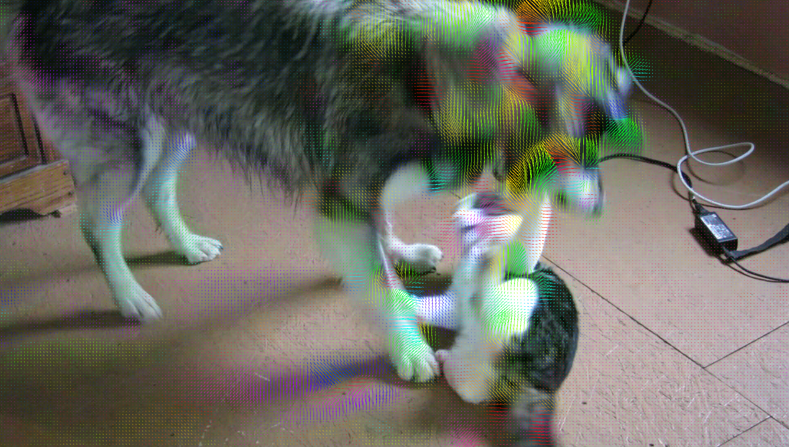
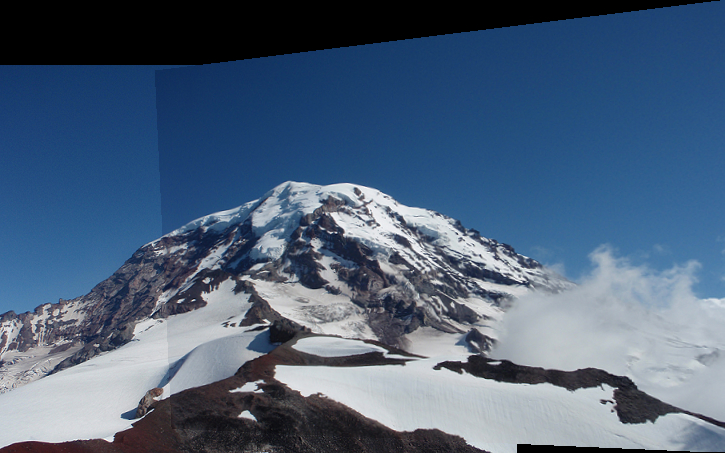
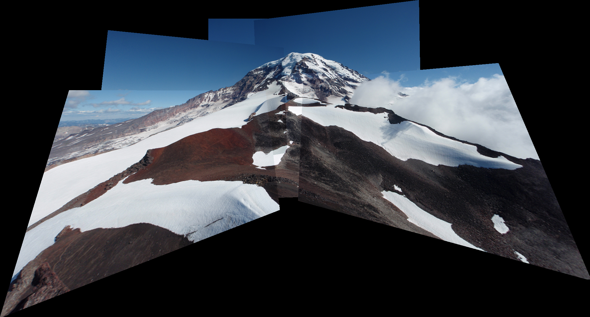

# Pixelflow !

This is my personal computer vision library, a derived work from ["The Ancient Secrets of Computer Vision"](https://pjreddie.com/courses/computer-vision/) a course given by [Josep Redmon](https://pjreddie.com) at Washington University. 

This library is primarily focused on the implementation of academical papers to extend Josep Redmon work.

To get started, make sure you have `git`, a C compiler, and `make` installed. Then run:

## Install

```bash
$ mkdir build && cd build
$ cmake ..
$ make
```

## Optical Flow

```python
from pixelflow import *

a = load_image("data/dog_a.jpg")
b = load_image("data/dog_b.jpg")
flow = optical_flow_images(b, a, 15, 8)
draw_flow(a, flow, 8)
save_image(a, "opticalflow")

```



## Image Panorama

```python
from pixelflow import *

a = load_image("data/Rainier1.png")
b = load_image("data/Rainier2.png")
m = find_and_draw_matches(a, b, 2, 50, 3)
save_image(m, "matches")

im1 = load_image("data/Rainier1.png")
im2 = load_image("data/Rainier2.png")
pan = panorama_image(im1, im2, thresh=50)
save_image(pan, "easy_panorama")

```

Matches             |  Panorama
:-------------------------:|:-------------------------:
  |  

We can even add more images to match them and make a bigger panorama!

```python
from pixelflow import *

im1 = load_image("data/Rainier1.png")
im2 = load_image("data/Rainier2.png")
im3 = load_image("data/Rainier3.png")
im4 = load_image("data/Rainier4.png")
im5 = load_image("data/Rainier5.png")
im6 = load_image("data/Rainier6.png")
pan = panorama_image(im1, im2, thresh=5)
save_image(pan, "rainier_panorama_1")
pan2 = panorama_image(pan, im5, thresh=5)
save_image(pan2, "rainier_panorama_2")
pan3 = panorama_image(pan2, im6, thresh=5)
save_image(pan3, "rainier_panorama_3")
pan4 = panorama_image(pan3, im3, thresh=5)
save_image(pan4, "rainier_panorama_4")
pan5 = panorama_image(pan4, im4, thresh=5)
save_image(pan5, "rainier_panorama_5")

```

